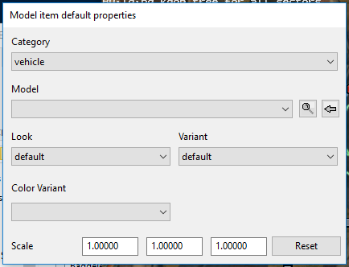
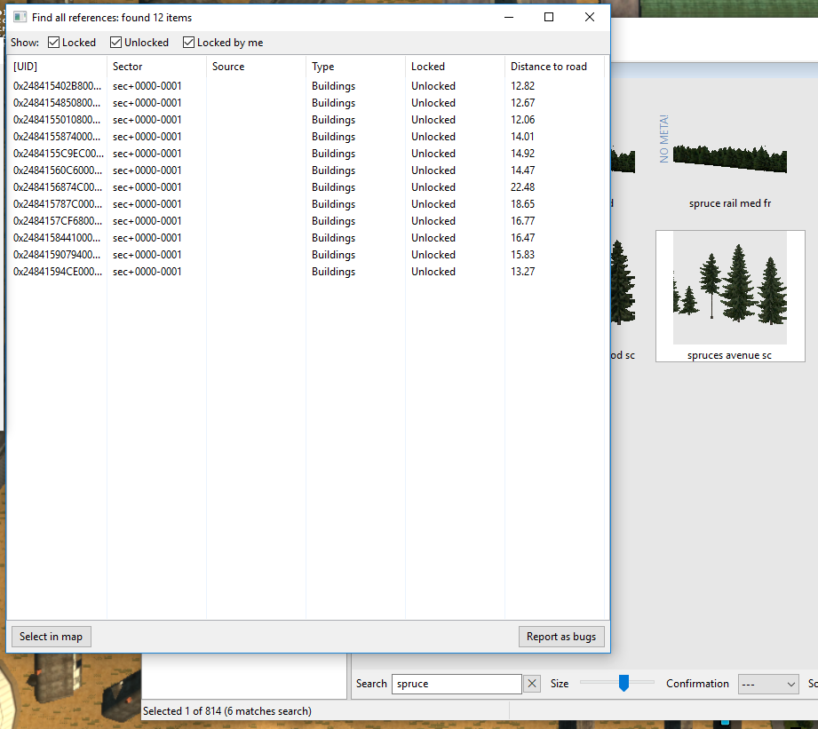

# Decorating Your Map

The next step in map building is to decorate your map with convincing details.  We've introduced this topic already with the Properties
of road segments:  we've seen how procedural vegetation can be generated to populate the sides of the road with trees, bushes, flowers, etc; and we've seen how materials can be selected to give the terrain each side of the road a distinctive look (ploughed field, grassland, desert, etc), as well as to vary the road surface colour and texture.

Now we'll take a closer look at all the cool set-dressing available in the Map Editor:  the types of objects you can place on your terrain to make a believable world.

There are three main object types you'll be using to decorate your map:  Prefabs, Models, and Buildings.

You've already worked with *Prefabs*, in the form of road intersections.  Some bridges are prefabs.  There are quite a few more sophisticated types of prefab.  In general, any "active" area of the map (a place where you interact with the scenery in some way) is a prefab.  These include gas stations, freight terminals, ferry terminals, sleeping areas, etc.  Prefabs cannot be scaled.  (Prefabs also cannot be edited in Blender or 3DSmax:  you will need a special 3D editor such as Zmodeler3 to preserve all their functions.)

*Models* are by far the most common object type you'll use when dressing up your bare map.  Models include just about everything:  buildings, trees, parked vehicles, people, bridges, statues, cows, chickens, all kinds of stuff.  Some models are animated;  others are static.  Models can be scaled.

*Buildings* are a curious class which does not, for some reason, only include buildings.  "Buildings" includes items that can be generated along a path, such as extensible fencing and railings, lines of trees for boulevards and wind breaks, etc.

There are also other objects such as *Signs*, but we'll talk about them later because they can get complicated.

To start placing objects in your world, first go to the overhead camera view (using C to toggle between camera views).  Now pick an Item Type (from the menu at right of toolbar) -- for now, pick 'Model'.  Use the plus (+) button at left of the toolbar, or hit E on your keyboard, to get into "placing new stuff" mode.  

This should pop up a "new item" dialogue box like the one you see here.   It offers you a Category dropdown menu and a Model dropdown menu (for now, ignore the other options). You can use Category to filter the Model menu. Just for grins, set Category to "vehicle" and try out the dropdown Model menu.  [MISSING IMAGE!]

It's quite a long list, and though the item names are mnemonic and could eventually become familiar, you'll find yourself "shopping around" in it to find what you want.  Fortunately this shopping process is quick and easy, with an instant preview (sort of).

As soon as you select something from the Model menu and move your mouse over the map, your cursor becomes an instance of the selected item (as seen from the top); and when you click on the map, that object is instantiated on the map at that location.  

Easy though this is, you can't see the object until you select it and move the mouse onto the map.  It would be rather tedious to keep shopping on a trial and error basis, clicking and mousing, until you find one you like.  Also, the top view is not always helpful in identifying the object, whereas the free cam view is not always helpful in placing the object.

So, before you get RSI interacting with the lengthy and only weakly descriptive drop-down menus in this box, let's talk about an even easier way to identify items to place in your map.

## Finding Objects to Place:  the Content Browser

Let's say you'd like to have a scenic ruined building at the intersection of two of your roads.  How to find one?

The Content Browser is the tool for this job.  Take another look at that New Item popup window.   Next to the object select menu you'll see a couple of iconic buttons:  a magnifying glass and an arrow gizmo.  The magnifying glass will bring up the Content Browser, showing the selected object.

The first thing to do with the Content Browser is to use the View menu (bottom option, Layout) to set your Layout to "Complex".  Only the complex layout will offer you the search features that you'll be needing soon.  So go ahead and set the Complex Layout.  Now the window has more panes and is larger, and down at the bottom centre you'll see a very important textbox called Search.

Now, let's get set up to do a search.  Let's say you don't know what Type of object (listbox at upper left) you are looking for.  So you choose All (top option in listbox).  Now type "bicycle" into the Search box.  You should see this, or something similar:

The simplest thing you can now do is choose this object to be the next one you are placing.  There are two ways to do this.

1) (definitely preferred) *double click* on the object thumbnail in the Content Browser.   This will set the item type, load the item into the New Item popup, and when you move your cursor over the map you will be ready to place this item by clicking anywhere, just as if you had gone through all the steps above (selecting type, using dropdowns).

2) select the thumbnail with just one click, then use the arrow button in the New Item popup to set this item as the selected one in the dropdown menu.  Note that this *will not work* (nothing will happen) unless you already have the matching Item Type selected (right hand side of the map window toolbar).  So it is more confusing and error-prone than the double-click method.

Aside from choosing a desired object from the vast catalogue of props and decorations, you can use the Content Browser to find out more about your selected object.  It will in fact tell you everything about it, including whether (and where) it has been placed in your map.

The pane on the far right shows detailed information about the selected object, including what Type of object it is.  For reasons which are entirely obscure to me, this Bicycle is a Sign.  (You might think it would be a Model, but no, it's a Sign.)  It can be helpful to know what Type your object is, because the searching process is much faster if you can narrow this down instead of searching all Types ("All" option at upper left).

This pane will also tell you whether the item (if a Model) is high or low res (Distance type = near or far), and where it came from.  The Source field reads 'base' if the object is included in the base game, 'dlc_north' if it comes from the Scandinavia DLC, and so on.  For models, this pane even gives you the relative pathname to the model file in an unpacked 'base' hierarchy, so you can locate and extract the model and modify it using your own 3d editor such as Blender or 3ds Max (this topic is covered in a separate tutorial).

If you are not working on a brand new map of your own, but have used "edit europe" to have a look at the inner workings of your actual installed game, then you can use this feature to find out what models and other goodies other people have used in their work.  For example, if you like the hovering helicopter in RusMap, you could launch your fully modded game, go into dev console, type "edit europe," and search for "heli" until you find the one you liked.  You could make a note of its name, type, etc. and plan to use it in a map of your own.  (I should remind you at this point that there are many warnings online about starting up the editor with lots of mods;  don't be surprised if it crashes when you have a busy mod folder.  Include only the mods actually necessary to do what you want to do.)

But the object's type, provenance, etc. are not all you can find out.  If you *right-click* on the thumbnail of the bicycle you've selected, you should see a menu.  The bottom-most item on this menu will be "Find All References."  This is a very handy feature.  It will pop up a list of every instance of this object in your current map.  So, for example, if you want to match (or not to repeat!) the type of tree or other model you used earlier, you can search for the general type of tree (Pine for example) and then check to see which pines you've used before and how often.  Here's a sample search on a small tutorial map of mine, for a spruce avenue I used along the roadside in several places:

There is one more very cool thing the Content Browser can do for you.  When you have the References pane active, with its N lines describing each instance of the object in the current map, you can *double-click* on one of those lines.  When you do this, you are automagically transported to the location of that object.  It will occupy the centre position of your map.  You will be looking straight down at it in overhead cam mode.

As you can see, the content browser is an essential tool;  you may want leave it up while you edit (just tuck it behind your map editing window when you don't need it, then pop it to the front when you need to look something up).

## Selecting and Placing an Object

Now that you know how to select an object from a visual catalogue (using the Content Browser), you can have some fun populating your map with various decorations.  Have fun experimenting with the various object types.

Note:  Among the items confusingly known as Buildings are several "strings of things" objects, such as rows of trees or shrubs, hedges, fences, etc.  You can extend these alongside roads, for aesthetic reasons or as a visual barrier.

As you decorate your world, you'll probably switch between camera modes quite a bit, using the overhead view to place objects and the flying cam to see how it looks from the ground.  You can continue editing the world in flying cam mode -- just hit *Space* to toggle betwen editing mode and free roaming mode.  With the flying cam you can see elevation views, from any position and angle, of your world-in-progress.  In editing mode, object handles will appear and you can perform the same actions you're accustomed to in plan view.

If you find that an object has instantiated in mid air, you can grab its control handle and drag it downward in H mode. Or you can use a handy shortcut key:  F6.  If you select the object so that it highlights (this is a pale blue colour in my version of the editor), then hit F6, the object will leap to ground level.

## Making space to place an object:  the Vegetation Sphere

Let's say you've used the Vegetation parameters of your road segment to make a very attractive forest terrain each side of your road, and you're quite happy with it -- but you want to put a house or inn or some other attractive building by the roadside as well.  The problem is that there's no space big enough, between the trees, to put your house.  Wherever you put it, there's a tree growing out of or through it;  and unless it's a ruin and you want that effect, that's a problem.  The forest is procedurally generated, and it doesn't know or care where the models are.

You could, of course, get rid of the vegetation on this particular bit of roadside terrain and re-create it by hand, placing individual tree models.  That would be incredibly tedious.  Or you could have buildings only in big cleared segments of terrain, but that would be unnatural and limiting.  So the editor devs have given you a tool to solve this problem.

The *Vegetation Sphere* is an attribute of a terrain or road segment, activated by a button at the BOTTOM of the Properties popup window.  Despite its name, the Vegetation Sphere is actually a NO-Vegetation-Sphere:  it defines a region in which the procedural vegetation generator will not place objects.  Now you can locate a building in a wooded area.  You can fill up your terrain with generated woodland, as dense as you like, but add a Veg Sphere of appropriate diameter where you want the building to go.

When it's time to paint this part of the map, the vegetation generator will simply not place any objects which would fall within the perimeter defined by the sphere's intersection with the terrain.  So you'll see a circular or oval patch where you can place your building without those trees growing through the walls and roof.  The Veg Sphere only prevents procedural vegetation, not placement of individual tree/shrub models. It will not prevent you from adding some trees by hand, if you do want some growth closer to the building than the clearing perimeter.  Hint:  a few hand-placed trees can camouflage the artificial shape of the clearing.

You now know all the basic steps of the workflow for building a map:  how to invoke the editor, how to save and reload your map, how to create and link road segments and prefabs, how to decorate your roadsides and roads using Properties, and how to generate extra terrain and decorate your world with freestanding objects of various kinds.  We'll conclude the beginner tutorial with one more chapter about the importance of maintaining the immersive illusion.

[<- Tutorial 3 - Testing your map](3_testing.md) --- [The Immersive Illusion->](5_illusion.md)
