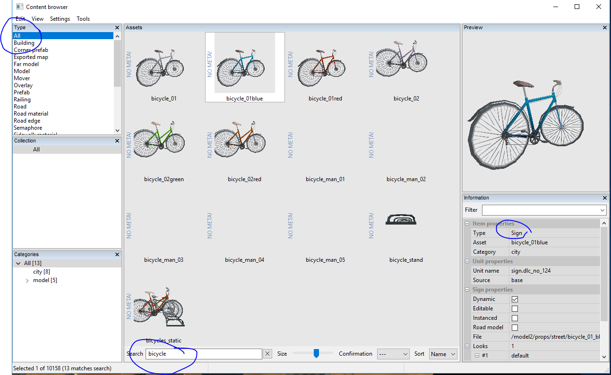

## Decorating Your World

The next step in map building is to decorate your map with convincing details.  We've introduced this topic already with the Properties
of road segments:  we've seen how procedural vegetation can be generated to populate the sides of the road with trees, bushes, flowers, etc; and we've seen how materials can be selected to give the terrain each side of the road a distinctive look (ploughed field, grassland,
desert, etc), as well as to vary the road surface colour and texture.

Now we'll take a closer look at all the cool set-dressing available in the Map Editor.

There are three main object types you'll be using to decorate your map:  Prefabs, Models, and Buildings.

You've already worked with *Prefabs*, in the form of road intersections.  There are quite a few other types of prefab.  In general, any "active" area of the map (a place where you interact with the scenery in some way) is a prefab.  These include gas stations, freight terminals, ferry terminals, sleeping areas, etc.

*Models* are by far the most common object type you'll use when dressing up your bare map.  Models include just about everything:  buildings, trees, parked vehicles, people, bridges, statues, cows, chickens, all kinds of stuff.  Some models are animated;  others are static.

*Buildings* are a curious class which does not, for some reason, only include buildings.  "Buildings" includes items that can be generated along a path, such as extensible fencing and railings, lines of trees for boulevards and wind breaks, etc.

# Finding Objects to Place:  the Content Browser

So, let's say you'd like to have a scenic ruined building at the intersection of two of your roads.  How to find one?

The Content Browser is the tool for this job.  If you use E to get into New Object placing mode (or click on the "plus" button at left of the toolbar), a small new window will pop up.  It should display the last object you placed of whatever type you've selected from the menu at upper right (Model, Building, Prefab etc).  Next to the selected object will be a couple of iconic buttons:  a magnifying glass and an arrow gizmo.  The magnifying glass will bring up the Content Browser, showing the selected object.

The first thing to do with the Content Browser is to use the View menu (bottom option, Layout) to set your Layout to "Complex".  Only the complex layout will offer you the search features that you'll be needing soon.  So go ahead and set the Complex Layout.  Now the window has more panes and is larger, and down at the bottom centre you'll see a very important textbox called Search.

Now, let's get set up to do a search.  Let's say you don't know what Type of object (listbox at upper left) you are looking for.  So you choose All (top option in listbox).  Now type "bicycle" into the Search box.  You should see this, or something similar:

The simplest thing you can now do is choose this object to be the next one you are placing.  There are three ways to do this.

1) double click on the object thumbnail in the Content Browser.   This will set the item type, load the item into the New Item popup, and when you move your cursor over the map you will be ready to place this item by clicking anywhere.

2) select the thumbnail with just one click, then use the arrow button in the New Item popup to set this item as the selected one from the dropdown menu.  Note that this will not work (nothing will happen) unless you already have the matching Item Type selected (right hand side of the map window toolbar).  So it is more confusing than the double-click method.

3) set the New Item popup selections to match the Category and Type of your item, then use the dropdown menu to choose the specific item.  I think one attempt at this is likely to convince you that methods 1 or 2 are far easier.  The dropdown menu is generally very long, the names are long and hard to scan, and why go through all that when just one dbl-click (method 1) will do what you want?

Aside from choosing this object from the vast catalogue of props and decorations, you can use the Content Browser to find out more about the selected object.  It will tell you everything about it, including whether (and where) it has been placed in your map.

The pane on the far right shows detailed information about the selected object, including what Type of object it is.  For reasons which are entirely obscure to me, this Bicycle is a Sign.  You might think it would be a Model, but no, it's a Sign.  It is helpful to know what Type your object is, because the searching process is much faster if you can narrow this down instead of searching all Types ("All" option at upper left).

This pane will also tell you whether the item is high or low res (Distance type = near or far), and where it came from.  The Source field reads 'base' if the object is included in the base game, 'dlc_north' if it comes from the Scandinavia DLC, and so on.  This pane even gives you the relative pathname to the model file in an unpacked 'base' hierarchy, so you can locate and extract this model and modify it using your own 3d editor such as Blender or 3ds Max (this topic is covered in a separate tutorial).

But the object's type, provenance, etc. are not all you can find out.  If you *right-click* on the thumbnail of the bicycle you've selected, you should see a menu.  The bottom-most item on this menu will be "Find All References."  This is a very handy feature.  It will pop up a list of every instance of this object in your current map.  So, for example, if you want to match (or not to repeat!) the type of tree or other model you used earlier, you can search for the general type of tree (Pine for example) and then check to see which pines you've used before.  Here's a sample search on a small tutorial map of mine, for a spruce avenue I used along the roadside:

If you are not working on a brand new map of your own, but have used "edit europe" to have a look at the inner workings of your actual installed game, then you can use this feature to find out what models and other goodies other people have used in their work.  For example, if you like the hovering helicopter in RusMap, you could launch your fully modded game, go into dev console, type "edit europe," and search for helicopters until you find the one you like.  You could make a note of its name, type, etc. and plan to use it in a map of your own.

The content browser is an essential tool, and you can leave it up while you edit (just tuck it behind your map editing window when you don't need it, then pop it to the front when you need to look something up).

Before we move on, there is one more very cool thing the Content Browser can do for you.  When you have the References pane active, with its N lines describing each instance of the object in the current map, you can *double-click* on one of those lines.  When you do this, you are automagically transported to the location of that object.  It will occupy the centre position of your map.  You will be looking straight down at it in overhead cam mode.

[WIP... to be continued]

(Don't forget about) The Vegetation Sphere is an attribute of a terrain or road segment, activated by a button at the BOTTOM of the Properties popup window.  Despite its name, the Vegetation Sphere is actually a NO-Vegetation-Sphere:  it defines a region in which the procedural vegetation generator will not place objects.  This can be handy if you want to locate a building in a wooded area, for example.  Instead of having to hand-craft a woodland around the building, leaving a clearing for it, you can just fill up your terrain with generated woodland but add a Veg Sphere of appropriate diameter where you want the building to go.

The vegetation generator will simply not place any objects which would fall within the perimeter defined by the sphere's intersection with the terrain.  So you'll see a handy circular or oval patch where you can place your building without trees growing through the walls and roof.  The Veg Sphere only prevents procedural vegetation, not placement of individual tree/shrub models. It will not prevent you from adding some trees by hand, if you do want some growth closer to the building than the clearing perimeter.  Hint:  a few hand-placed trees can camouflage the artificial shape of the clearing.  
