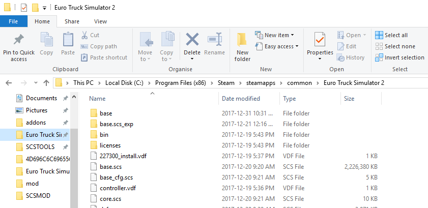
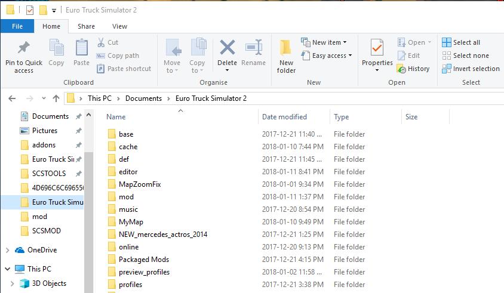
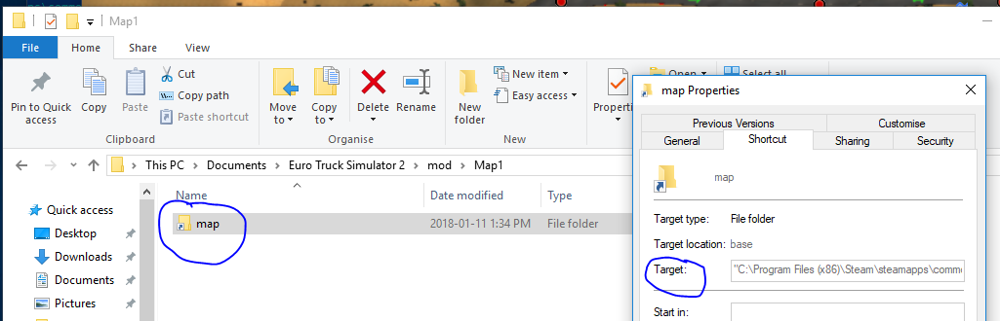
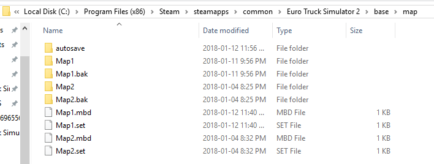
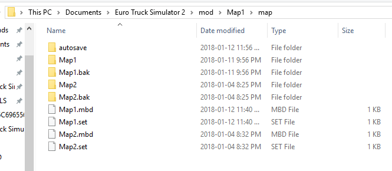

## Editing in the Fast Lane

The conventional wisdom, as discussed in [Testing Your Mod](3_testing.md), is that you must exit the game after saving your map, repackage/reload the mod,
and restart the game.

However, if you'd like to skip these steps, there is a way.  Recall that there are two essential folders in the SCS game world.  One we'll 
call **INSTALL** -- that's the folder where the ETS2 or ATS binaries and base files were installed.  It looks like this:



The other we'll call **USER**.  That's the one where you keep your profiles, your mod folder, and other stuff specific to your personal install of the game.  It looks like this:



If you want to avoid the quit/repack/reload/start cycle, here's how.

In your **USER/mod** folder, make a folder called *YourMapName* (for easier repackaging later, you probably want to make this name match your map file name, but actually you can call it anything you like -- see below).

Within this **USER/mod/*YourMapName*** folder, make a LINK to **INSTALL/base/map**



If you do this right, then when you go to **USER/mod/*YourMapName*/map**, you will find yourself in **INSTALL/base/map** ... and you can edit, save, run, and edit again without ever leaving the Map Editor.

If you are a n00b (or a prolific mod developer), you might be editing more than one map at a time.  You might have saved more than one *YourMapName*.mbd file and *YourMapName* folder in **INSTALL/base/map** -- I,for example, have a Map1 and a Map2 and will probably have more, as I make small standalone maps to try out different methods & learn specific things.  That doesn't matter.  If you are working on more than one map mod, just give it a different name for editing and saving.  It will get saved in the same location

Example:  Let's say I'm just learning the editor, and I have 2 tutorial projects going on:  Map1 and Map2.  I use *edit Map1* or *edit Map2* to work on them, and they get saved to the **INSTALL/base/map** folder.  So in that folder I see



To avoid the pesky quit/repack/restart cycle, I put the symlink in my USER hierarchy as you see here



Observe that both Map1 and Map2 are found here successfully by the editor and game, even though the name of the grandparent folder in the USER hierarchy is Map1, not Map2.  It now becomes obvious to me that I could have called that grandparent folder MickeyMouse, or more sensibly MapEditing, and everything would work just fine.

However, when I come to repackage my mods for sharing -- assuming I want to do that -- if they conflict at all or for any reason should not be loaded together, I'll have to separate them into two distinct zip files either manually or by means of a script.  And as Komat notes (SCS forum):

```
If you have multiple mods having different content of the same map files, 
you need to ensure that the base folder contains the content for the mod 
you want to edit. In that case you can reverse the process, keep the map 
files in USERPATH/mod/mod_name/map and link corresponding USERPATH/mod/mod_name/map 
into INSTALLPATH/base/map when you want to work on that mod.
```

### How to make symbolic links

Making these links in Windows is not as straightforward as I'm used to (coming from 'nix territory).  You might be able to use *mklink*, or the *junction* command, or the extension HardLinkShellExt_64, or the Windows Power Shell *new item* command.  I used 'new item'...

```
 ni .\Map1\map -i SymbolicLink -ta  'C:\Program Files (x86)\Steam\steamapps\common\Euro Truck Simulator 2\base\map'
```

... but you will have to figure out what works for you.  Here's a thread that covers the topic.  Good luck!

https://superuser.com/questions/1020821/how-to-create-a-symbolic-link-on-windows-10

If you do this right, you should be able to Save your map periodically and test it with Run, without exiting the game and repackaging as a mod file in between.


