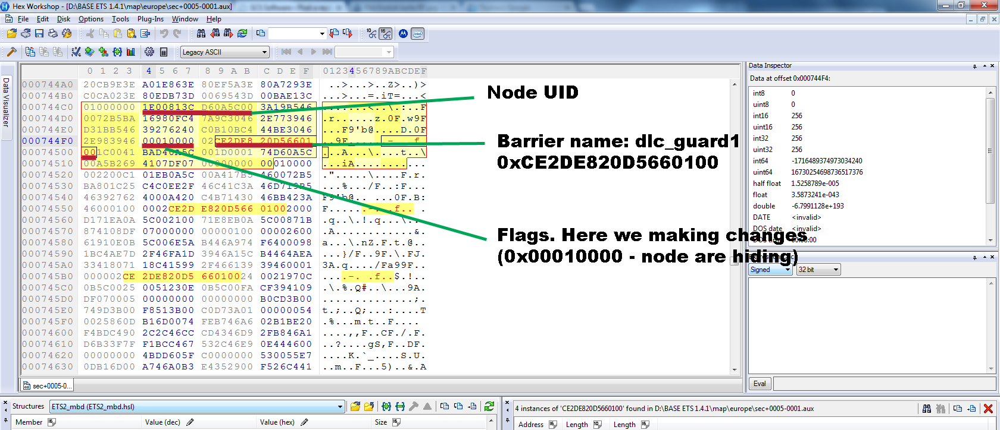

## Power Mapping

There is no "Advanced" section in this manual, but this chapter is about as close as we get to one.  If you are a novice mapper, it would be a good idea to go through the earlier chapters -- and do some practise mapping -- before you read this part.

### How do I avoid repackaging the entire game map?  I'm only altering a small portion of it.

When you save your map edits, review the sector definition files in the *MapName* folder.  (**INSTALL/base/map/*MapName***)

Use your favourite file viewer to sort this folder by reverse touch date (most recent first).  You should see a clean distinction between the dates on original game files and those of files you have altered by editing and saving.  The Map Editor does not bother overwriting every sector in the map, only the sectors you have changed.

You can then, at packaging time, select only the sector files you have altered, and include those in your mod zipfile.

### What is an Atlas and how do I use it?

### How do I internationalise my city names?

### Understanding map scale and background images

### Hookups and Overlays

### More about Cutplanes

You'll get more and better use out of cutplanes if you understand the rules for hiding objects behind them:

* simple object:  node must be behind cut plane
* road segment:  both nodes must be behind
* bezier patch:  master mode must be behind
* prefab:  *all* nodes must be behind

### Distant Object Rendering:  peekaboo mountains explained

The game engine imposes some limits (to optimise performance) on how far away objects are visible.  The algorithm deciding where visibility is cut off gets tweaked now and again by the engine devs.  It can produce some strange effects at times.  For example, if you want scenic mountains to be visible far off over open country, you may not get quite what you expect.  Why?

Models in the game have a "distance" attribute, which allows the game to skip rendering them if they are further away than their "distance rating".  The ratings are Near, Middle, and Far.  You could with some effort override these settings and make every detail in your map "far", but that would come with a horrendous performance price tag at runtime.  So it pays to stick with the usual distance ratings.

However, there is no "Really, Really Far" -- such as you would like for mountains far off across the plains.  The symptom of this is that as your player approaches the "far" horizon, your distant mountain will suddenly pop into existence.  This is illusion-breaking and can be frustrating.

As plykkegaard notes:  "They changed the rendering engine a while ago to allow a little more FPS.  It works, but at a price.  The distance to the rendering boundaries is fixed -- thus the edges of the image (left/right) are not rendered (too far away).
Good place to see the issue is Iceland, but any open space with mountains in the distance will reveal the issue."

And in fact, in Iceland where there are no trees and long, long sightlines, you can see mountains slithering into existence and disappearing again as you rotate your camera POV.  What's happening is that the path from your POV to the object dead ahead is shorter than the path to the objects at extreme L and R ahead of you (diagonal vs orthogonal line).  As you rotate the camera, the direct (shorter) line of sight (like a laser beam) contacts new areas of the distant landscape, and parts of it pop into existence.  Meanwhile others disappear as the diagonal line of sight gets longer.  

Right now there is no remedy for this:  live with it, or give up huge vistas with distant tall objects.  It is a perennial complaint about the Prism3D rendering engine, and seems unlikely to be fixed.  The base game doesn't feature wide open spaces, probably for this reason.  I enjoy Iceland anyway, despite the weirdly slithering skylines.  Just imagine that you have gone too long without a rest break and are starting to see things :-)

Here's a (very) technical article on bounding volumes, KDOP, object acceptance and rejection for rendering... if you want to dig into this very deeply: https://en.wikipedia.org/wiki/Bounding_volume

 ``` 
  ADVANCED MAPPING

	background image and map scaling
	understanding map scale
	internationalizing city names
	how to make standalone map
	hookups and overlays
	what is an Atlas
	removing game's collision barriers to extend stub roads

```

## Remove Invisible Barriers

WARNING:  this is not an errand for the faint-hearted.  You need to have a binary editor and know how to use it.

Still want to proceed?  Follow this example:

This barriers names as "dlc_guard1" and "dlc_guard2". Their codenames are 0xCE2DE820D5660100 and 0xCE13EF7F18FD0100.

1) Open .aux file for sector, where is placed that barrier and find one of this codenames.
2) Move backwards 53 bytes to find 8 byte UID
3) Copy UID
4) In map editor find that UID ('f' key' and paste in UID)
5) Is this really the object we are looking for? If yes, return to hex-editor 
6) Five bytes before codename we find the object/node flags
7) Change this value to default value (ex. 0x01000000)
8) Save file, and put it into .zip/.scs mod :)
9) Put .scs file in your **USER/mod** folder, relaunch



(thanks to \_PMA for this expert answer)
