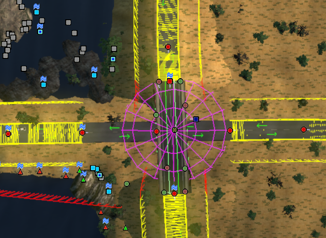

```
ERRORS, FINDING STUFF, DEBUGGING
	
	how to find a prefab by its number
	how to remove no-go barriers
```

## Getting the Most Out of the MiniCon

I assume you're running the minicon while editing (uset g_minicon "1").  If you aren't, you probably should be.  It's useful to see error messages in real time as you work.  But did you know that you can set g_minicon to values higher than 1?

* minicon value 2 shows triangle count detail (good for understanding performance issues)
* minicon value 3 shows draw call detail, ditto
* minicon value 4 shows element counts of each type 

### ouch, I ran into an invisible barrier while testing my map!

This is most likely at a bridge or overpass, but could potentially occur under other circumstances.  The way to find out what the heck you just ran into, is to turn on visibility for Collision Boxes.

You can use *uset g_colbox 1* in the dev con, or (faster/easier) go to the View menu and select "Collisions".  You should then see something like this:



Here two roads cross, with the N/S road going over a bridge and the E/W road passing under it.  I have turned *off* the collision boundary for the bit of roadway that runs under the bridge.  Before I turned this off, I was hitting the invisible barrier when I tried to drive over the bridge.

Collision boundaries may show up in red, or yellow.  So far, no one has been able to tell me whether the colour difference means anything.

### *maximum water level count exceeded / failed to register water level for uid XXXXXXX*

This message is usually due to the close proximity of two water planes with different heights.  Usually, it can be ignored.  The game engine gets a little confused about reflection management in such cases and you may see reflection glitches, but it shouldn't affect gameplay or cause a crash.  When you use one of the water textures on a terrain to make a water plane, the game engine notices that and treats it as a "water level".

### index outside array bounds (plus stamp count warnings)

By default the warning about exceeding stamp_count is set at 40, and a similar warning about exceeding road_length set at 330m.
To get rid of these warnings, simply increase the value of these limits in the file /def/editor_data.sii and add this file to your mod.

### FIND example -- error message about a specific UID, such as "too small" 

1) Open game_log.txt with your favourite text editor.  Find the error message, highlight the UID and Copy it.
2) Return to editor, use overhead camera, hit F (for Find).  Paste the UID into the UID field in the popup dialogue box.
3) Invoke the Find (button at bottom of box)
4) You should teleport to a position directly above the troubled node.

Now it's up to you to zoom in, find the node, check its properties and remedy the problem.  The "too small" error is thrown when a Building (Series or Chain) object is too small to display all its features.  The solution is to stretch it, or to delete it and make a fresh one in a more suitable size.


